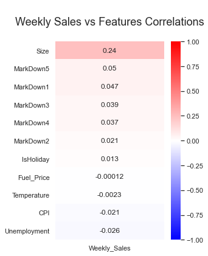
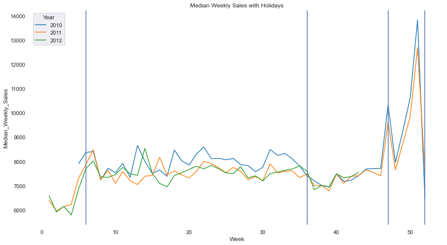
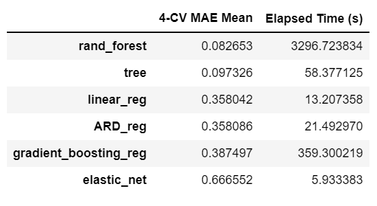
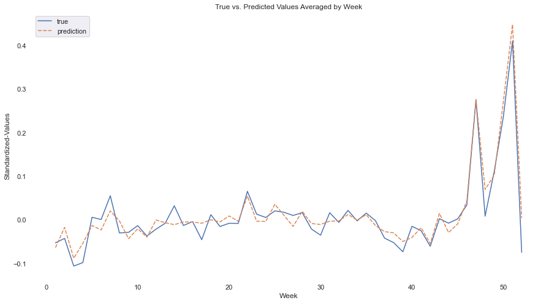

# Walmart Sales Forecasting

*With 56% of U.S. grocery market-share, 4,743 U.S. stores, 240M customers worldwide, and $559B in worldwide revenue it’s easy to say that Walmart is huge (Statista 2021, April 27), and with Walmart’s huge size comes huge amounts of data. Thus, in 2014 they created a public competition for data-scientists to predict store sales using a selection of their anonymized datasets. The prizes were potential positions at Walmart.*

*Here, I accept that challenge.*

[Walmart Recruiting - Store Sales Forecasting](https://www.kaggle.com/c/walmart-recruiting-store-sales-forecasting)

## The Data
Stored across multiple .csv files, once merged and cleaned the main features include:

> * Date (2010-2013)
> * Store (45 unique, numeric)
> * Department (many unique per store)
> * Weekly Sales (target feature, $)
> * Holiday (T/F, this is of particular importance
> * Store Size (numeric)
> * Etc. (Temperature, Fuel Price, Markdowns...)

## The Goal
Predict sales per store, per department, per year, per week.

## The Metric of Success
Mean Absolute Error (MAE)

## The Approach
This is a regression problem, thus experiment with many untuned regression machine-learning algorithms and see which perform best based on MAE.
Then, refine those best models with randomized-search cross-validation (RSCV). Randomized-search as opposed to grid-search so to reduce time and resources spent while also maximizing hyperparameter points explored. Performance is measured as the mean MAE over the cross-validation folds.
Of the refined models, choose the best performer on a basis of balance between cost and performance.
Finally, and again, refine the final chosen model’s hyperparameters via RSCV and review performance.

## The Findings
No features highly correlated with weekly sales (the target feature). Though, store size correlated higher than the other features by a long shot with a value of 0. 
To clarify, a value of 1.00 is perfect positive correlation, -1.00 perfect negative correlation.

Trends in sales were visibly (and predictably) annual, with spikes in sales occurring around holidays. The vertical blue lines denote the Super Bowl, Labor Day, Thanksgiving (Black Friday), and Christmas from left to right. These trends may be obvious, but nonetheless interesting to visualize and model with.

Now, modelling. Tree based models significantly outperformed their counterparts, as seen in this table of model vs. model performance:

Random-forest achieved the lowest mean 4-fold cross-validated MAE, but only marginally compared to a decision tree; especially when considering the difference in training time.
	Random-forest and decision-tree regressors were chosen to be refined via RSCV.

## The Results