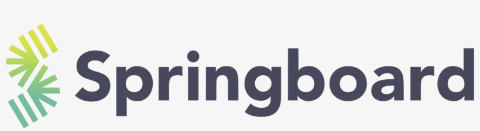

# My Springboard Repository

Howdy! I'm glad that you stopped by to check out my Springboard repository.

## What's in here?

Every commit I've pushed so that my mentor and others can view and review my work done at Springboard.

## What should I care about / focus on?

I'd look through the "Case Studies" folder. In it are many small projects focused on a certain technology or skill. They show my practical experience of what I've worked with, and yes, they were semi-guided.

## Why not the "Capstone Projects" folder?

I mean, you can, but they're the same as my other pinned repositories on my main GitHub page, although maybe a few commits behind.

## Okay cya later?

Cya later!